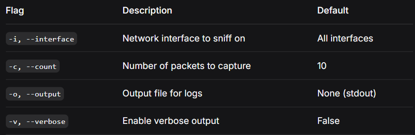

# 📡 Packet-Sniffer

[](https://github.com/adelkamell/Packet-Sniffer/actions)
[](https://badge.fury.io/py/packet-sniffer)
[](https://opensource.org/licenses/MIT)
[](https://pypi.org/project/packet-sniffer/)
[](https://codecov.io/gh/adelkamell/Packet-Sniffer)

> A lightweight, real-time packet sniffer built with Scapy for network security analysis and monitoring.

---

## 🚀 Features

- **Real-time packet capture** on any network interface
- **Protocol detection** (TCP, UDP, ICMP, and more)
- **Detailed packet analysis** with colorized output
- **Extensible architecture** for custom analyzers
- **Cross-platform** (Linux, macOS, Windows)
- **Low resource usage** with buffered processing

---

## 📦 Installation

### Using pip (recommended)
```bash
pip install packet-sniffer
```

### From source
```bash
git clone https://github.com/adelkamell/Packet-Sniffer.git
cd Packet-Sniffer
pip install -e .
```

### 💻 Quick Start
Basic usage
```bash
packet-sniffer
```

### Specify network interface
```bash
packet-sniffer -i eth0
```

### Limit number of packets
```bash
packet-sniffer -c 50
```

### Save output to file
```bash
packet-sniffer -o capture.log
```

### 🛠 Command Line Options



### 📖 Example Output
```text
[*] Starting packet sniffer on all interfaces
[+] 192.168.1.10 -> 8.8.8.8 (TCP)
    TCP Flags: SA
[+] 192.168.1.10 -> 8.8.8.8 (TCP)
    TCP Flags: A
[+] 192.168.1.10 -> 192.168.1.1 (UDP)
    UDP Port: 5353 -> 5353
```

### 🧪 Development & Testing
Run tests
```bash
pytest tests/ -v --cov=packet_sniffer
```

### Code coverage report
```bash
pytest tests/ --cov=packet_sniffer --cov-report=html
```

### open htmlcov/index.html
Linting
```bash
flake8 src/ tests/
black src/ tests/
```
### 🏗 Architecture
```text
Packet-Sniffer/
├── src/
│   └── packet_sniffer/
│       ├── __init__.py      # Package initialization
│       ├── sniffer.py       # Core sniffer engine
│       └── analyzer.py      # Packet analysis modules
├── tests/                    # Unit tests
├── pyproject.toml            # Package configuration
└── README.md                 # This file
```

### 📝 Usage in Python Code
```python
from packet_sniffer import PacketSniffer

# Initialize sniffer
sniffer = PacketSniffer(interface="eth0", count=20)

# Start sniffing
packets = sniffer.start()

# Process results
for packet in packets:
    print(packet.summary())
```
### 🔒 Security Considerations
Requires root/administrator privileges to capture packets

Only use on networks you own or have permission to monitor

Respect privacy and legal regulations in your jurisdiction

### 🤝 Contributing
Contributions are welcome! Here's how you can help:

Fork the repository

Create your feature branch (git checkout -b feature/AmazingFeature)

Commit your changes (git commit -m 'Add some AmazingFeature')

Push to the branch (git push origin feature/AmazingFeature)

Open a Pull Request


### 👤 Author
- Adel Kamell

- GitHub: @adelkamell

### 🙏 Acknowledgments
Thanks to the Go community for excellent tools and libraries

Inspired by tools like dirb, gobuster, ffuf, and dirsearch

Special thanks to security researchers and the open-source community

### **Made with ❤️ for the security community**
